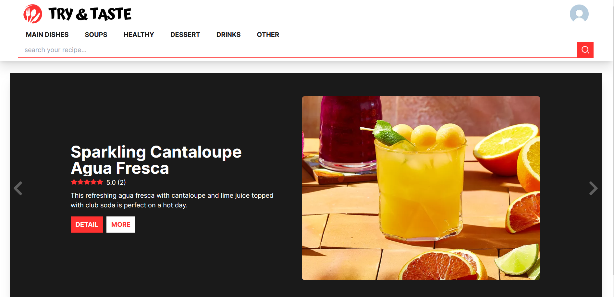
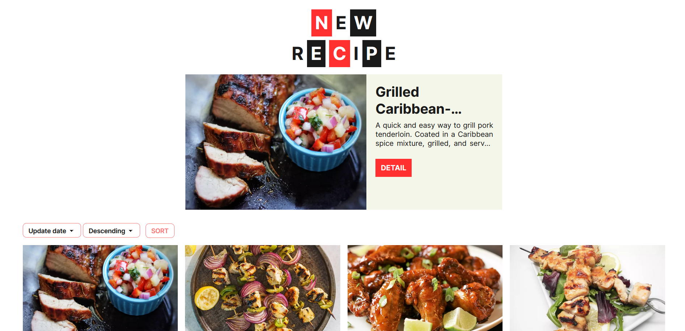
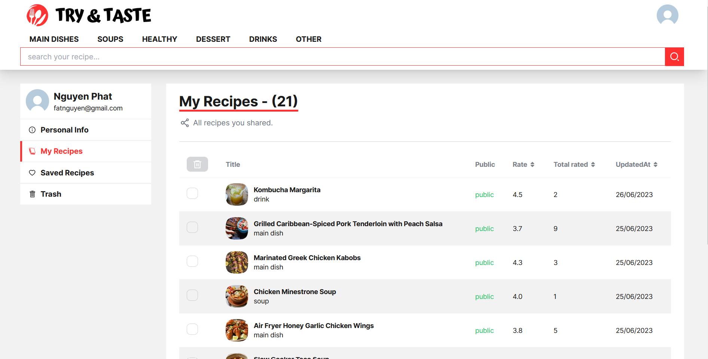
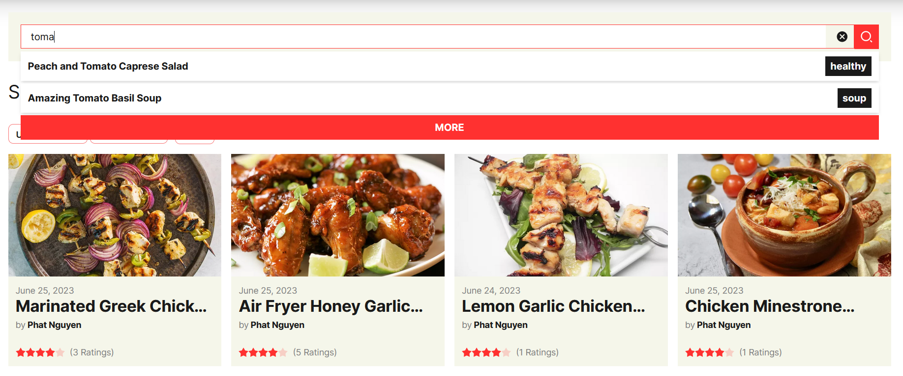

# Introduction

A recipe website that allows users to create, share, and manage cooking recipes. Users can also rate recipes through their own reviews and save their favorite recipes. The website regularly updates highly-rated recipes and offers various other features.

# Overview

Home page is constantly updated hot dishes.

Categorize dishes and update the latest ones.

User page manages user 's information and recipes.

Search page for recipes related to user search.

# Features

-   Register, Sign in, Sign out.
-   Update user information.
-   Add, delete, recipes.
-   Saved favorite recipes.
-   Review, search recipes.
